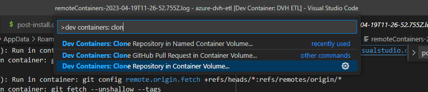
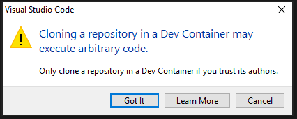
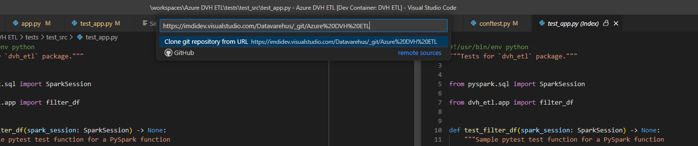
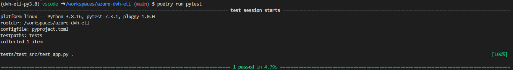

# Getting started

1. Install the following tools:
   * Make sure you have WSL 2 installed by running in a terminal `wsl --update`
   * [Visual Studio Code](https://code.visualstudio.com/)
   * Docker: the recommended option is to use Docker Desktop
     * **Request a license for Docker Desktop**
     * Download and install [Docker Desktop](https://www.docker.com/products/docker-desktop/)
   * VS Code [Dev Containers](https://marketplace.visualstudio.com/items?itemName=ms-vscode-remote.remote-containers)
     extension
   * **Do not use a VPN!!!**

2. Open the command palette (Ctrl+Shift+P) and search for "Dev Containers: Clone repository in
   Container Volume...".

   

   Follow the process to clone the Dev Container:
   1. You might need to approve the execution of arbitrary code:

      

   2. Enter the repository URL: `git@github.com:ghjklw/poetry-pyspark-devcontainer.git`
      and then click on "Clone git repository from URL".

      

   3. You might need to login using your Github account
   4. Wait... and wait again! It will take a long time but VS code should set up everything for you:
      * A docker container with PySpark, multiple versions of Python and some base tools for this
        project like PyEnv and Poetry
      * Set up the Poetry project and virtual environment with all the required dependencies
      * VS Code configuration
      * VS Code extensions useful for this project
   5. Before proceeding, wait again... all of the extensions should be first installed in the
       container. You will probably be asked to reload the window.

3. Test that everything works as expected. In particular:
   * Try running from a terminal `poetry run pytest`.
     If it does not work as expected, you can try reloading the VS Code window using the command
     palette (Ctrl+Shift+P) and searching for "Developer: Reload window".

     

   * Check that the terminal's command prompt is:
     `(poetry-pyspark-devcontainer-py3.10) vscode ➜ /workspaces/poetry-pyspark-devcontainer-py3.10 (main) $`

     If it isn't you must select the python interpreter by using the command palette and searching
     for the option "Python: select interpreter", then select "Enter interpreter path" and finally
     typing "./.venv/bin/python"
   * Open any Python file and check that:
     * No error is displayed, in particular no module import problems. The solution is also to
       redefine the Python interpreter path (see above).
     * You get automatic linting and formatting. You can, for example, check that:
       * If you remove some type hints (and save), you get a Ruff or Pylance error.
       * If you define a new unused variable (and save), you get a Pylint and Pylance error.
       * If you change the formatting (e.g. add some white lines), the formatting is restored when
         you save the file.
   * Run `pre-commit run --all-files`. All tests should pass.
